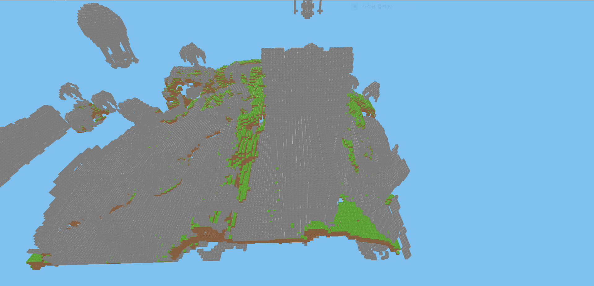

# Vokkit
  
웹 브라우저로 접속할 수 있는 복셀 서버 구동기입니다.
## 특징
- 청크 단위 사용  
상대적으로 성능이 안 좋아지는 웹에서도 시야를 타협해서 쾌적한 환경을 만들 수 있습니다.  
- 청크 생성 최적화  
안 보이는 부분은 아예 생성조차 하지 않습니다.  
- 웹에서 마인크래프트를 할 수 있습니다!  
## 개선할 점
- 블럭 이미지 처리 문제  
블럭 모서리에 흰 선이 생깁니다.  
## 개선된 점
- 램 과다 사용 문제  
기존 10만 블럭을 저장할 램이면 현재 155만 블럭을 저장할 수 있습니다.